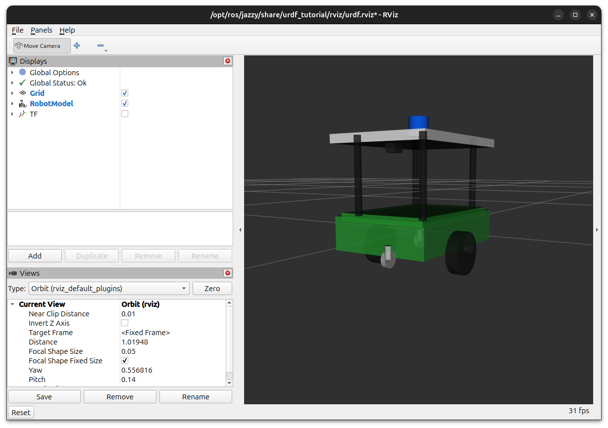

# 🍽️ Restaurant Service Robot (ROS 2 Jazzy)

A Restaurant Service Robot modeled using **URDF (Unified Robot Description Format)** in **ROS 2 Jazzy**. The robot is designed using basic URDF primitives and visualized in **RViz2**.

---

## 🚀 Features

- Differential Drive Mobile Robot
- Two Drive Wheels
- Three Caster Wheels
- Four Support Pillars
- Top Serving Tray
- RGB Camera
- LiDAR Sensor
- RViz2 Visualization
- ROS 2 Jazzy Compatible

---

## 📂 Project Structure

```
ros2-restaurant-service-robot/
├── launch/
│   └── display.launch.py
├── urdf/
│   └── robot.urdf
├── images/
│   └── restaurant_robot.png
├── README.md
└── LICENSE
```

---

## 🛠 Requirements

- Ubuntu 24.04
- ROS 2 Jazzy
- RViz2
- robot_state_publisher
- joint_state_publisher_gui

---

## ▶️ Launch

```bash
ros2 launch urdf_tutorial display.launch.py model:=/absolute/path/to/robot.urdf
```

Example:

```bash
ros2 launch urdf_tutorial display.launch.py model:=/home/m/ros2_wss/src/restaurant_robot/urdf/robot.urdf
```

---

## 📸 Robot Preview

> Add your RViz screenshot below.



---

## 📚 Learning Outcomes

- URDF Robot Modeling
- Robot Links & Joints
- Robot Visualization using RViz2
- ROS 2 Package Organization

---

## 👨‍💻 Author

**Madhana Vignesh V**

Robotics & Automation Engineering Student

GitHub: https://github.com/madhan-0209

---

⭐ If you found this project useful, consider giving it a star!
